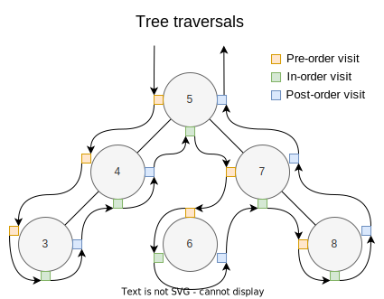

# Binary search tree in C#

A generic [binary search tree](https://en.wikipedia.org/wiki/Binary_search_tree) implementation in C# featuring tree traversals, range search and rebalancing. This library exists because there is no binary search tree available in the .NET library. If you need a self-balancing binary search tree, consider using the [SortedSet](https://docs.microsoft.com/en-us/dotnet/api/system.collections.generic.sortedset-1) of the .NET library, which is based on a red-black tree ([source](https://source.dot.net/#System.Collections/System/Collections/Generic/SortedSet.cs)).

[](https://github.com/m31coding/M31.BinarySearchTrees/blob/master/LICENSE)
[](https://dotnet.microsoft.com/en-us/)
[](https://www.nuget.org/packages/M31.BinarySearchTrees/)
[](https://github.com/m31coding/M31.BinarySearchTrees/actions?query=workflow%3Aci)
[](https://www.m31coding.com)
[](https://www.youtube.com/channel/UC6CZ_Bcyql1kfHZvx9W85mA)
[](https://twitter.com/m31coding) 

Accompanying blog post: [www.m31coding.com>blog>binary-search-tree](https://www.m31coding.com/blog/binary-search-tree.html)

# Installing via NuGet

```
PM> Install-Package M31.BinarySearchTrees
```

# Usage

More executable code examples may be found here: [M31.BinarySearchTrees.Storybook.csproj>Program.cs](src/M31.BinarySearchTrees.Storybook/Program.cs).

## Building blocks

```cs
public class BinarySearchTree<T>
{
    public BinarySearchTree();
    public BinarySearchTree(Node<T>? root);
    public BinarySearchTree(IComparer<T> comparer);
    public BinarySearchTree(Node<T>? root, IComparer<T> comparer);
    public BinarySearchTree(IEnumerable<T> values);
    public BinarySearchTree(IEnumerable<T> values, IComparer<T> comparer);

    public Node<T>? Root { get; set; }
    public IComparer<T> Comparer { get; }

    public Node<T>? Search(T value);
    public Node<T>? Maximum();
    public Node<T>? Minimum();
    public void Insert(T value);
    public void Insert(Node<T> node);
    public bool Delete(T value);
    public void Delete(Node<T> node);
    public void Replace(Node<T> node, Node<T>? replacement);

    public static implicit operator Node<T>?(BinarySearchTree<T> tree);
}
```

```cs
public class Node<T>
{
    public Node(T value);
    public T Value { get; }
    public Node<T>? Parent { get; set; }
    public Node<T>? Left { get; set; }
    public Node<T>? Right { get; set; }
    public override string? ToString();
}
```

## Creation

A tree can be created explicitly with the `TreeBuilder` class as follows:

```cs
BinarySearchTree<int> tree = TreeBuilder<int>
 .BuildTree(2, b => b
         .Left(1)
         .Right(4, b => b
             .Left(3)
             .Right(5)));
```

Alternatively, the same tree can be crafted by creating tree nodes and setting their `Left` and `Right` properties:

```cs
Node<int> root = new(2)
{
    Left = new(1),
    Right = new(4)
    {
        Left = new(3),
        Right = new(5)
    }
};

BinarySearchTree<int> tree = new BinarySearchTree<int>(root);
```

Adding one value after the other is supported by the `Insert` method:

```cs
BinarySearchTree<int> tree = new BinarySearchTree<int>();
tree.Insert(1);
tree.Insert(2); 
// ...
```

However, with this approach you don't have much control over the structure of the tree. In particular, the tree might not be balanced. 

If the values are known from the beginning, a balanced tree can be created by passing the values to the constructor:

```cs
BinarySearchTree<int> tree = new BinarySearchTree<int>(new int[] { 1, 2, 3, 4, 5 });
```

## Tree traversals

In a depth-first search of a tree, a node can be visited at different positions. Visiting a node when it is seen the first time, second time, or third time, results in a pre-order traversal, in-order traversal, or post-order traversal, respectively:



```cs
BinarySearchTree<int> tree = TreeBuilder<int>
 .BuildTree(5, b => b
         .Left(4, b => b
             .Left(3))
         .Right(7, b => b
             .Left(6)
             .Right(8)));

IEnumerable<Node<int>> inOrder = tree.Root.InOrderTraversal(); // 3, 4, 5, 6, 7, 8
var preOrder = tree.Root.PreOrderTraversal(); // 5, 4, 3, 7, 6, 8
var postOrder = tree.Root.PostOrderTraversal(); // 3, 4, 6, 8, 7, 5
var breadthFirstOrder = tree.Root.BreadthFirstSearch(); // 5, 4, 7, 3, 6, 8
```

In the latter method, the breadth-first search, the tree is traversed level by level. Note that there is no depth-first search method because the ordinary depth-first search corresponds to the pre-order traversal.

All of the above methdos internally require a stack or a queue. For this reason, we provide recursive versions that don't need additional data structures. They can be used by providing callbacks: 

```cs
public static void InOrderTraversal<T>(this Node<T>? tree, Action<Node<T>> onVisit);
public static void PreOrderTraversal<T>(this Node<T>? tree, Action<Node<T>> onVisit);
public static void PostOrderTraversal<T>(this Node<T>? tree, Action<Node<T>> onVisit);
public static void DepthFirstTraversal<T>(this Node<T>? tree,
    Action<Node<T>>? onEnter,
    Action<Node<T>>? onPass,
    Action<Node<T>>? onExit);
public static void DepthFirstTraversalNullNodesIncluded<T>(this Node<T>? tree,
    Action<Node<T>?>? onEnter,
    Action<Node<T>?>? onPass,
    Action<Node<T>?>? onExit);

```

A thorough discussion about the different traversal methods may be found on [Wikipedia](https://en.wikipedia.org/wiki/Tree_traversal).

## Range search

Range queries are supported via extension methods for the 
`BinarySearchTree`-class:
  
```cs
BinarySearchTree<int> tree = TreeBuilder<int>
 .BuildTree(2, b => b
         .Left(1)
         .Right(4, b => b
             .Left(3)
             .Right(5)));

IEnumerable<Node<int>> range1 = tree.GetNodesLessThanOrEqual(4); // 1, 2, 3, 4
var range2 = tree.GetNodesGreaterThan(3); // 4, 5
var range3 = tree.GetNodesGreaterThanOrEqual(3); // 3, 4, 5
var range4 = tree.GetNodesInRange(2, 5); // 2, 3, 4, 5
var range5 = tree.GetNodesInRange(2, 5, excludeLower: true, excludeUpper: true); // 3, 4
```

## Stringification

The following extension methods for nodes can be used in order to create a string from a tree:

```cs
BinarySearchTree<int> tree = TreeBuilder<int>
 .BuildTree(2, b => b
         .Left(1)
         .Right(4, b => b
             .Left(3)
             .Right(5)));

string treeString = tree.Root.TreeString(); // "(2(1(null)(null))(4(3(null)(null))(5(null)(null))))"
string inOrderTraversalString = tree.Root.InOrderTraversalString(); // "1-2-3-4-5"
string preOrderTraversalString = tree.Root.PreOrderTraversalString(); // "2-1-4-3-5"
string postOrderTraversalString = tree.Root.PostOrderTraversalString(); // "1-3-5-4-2"
```

# Contributing

Would you like to improve this project? You are invited to contribute. If you would like to implement a new feature, please create a GitHub issue and you will receive timely feedback.

Happy coding!
